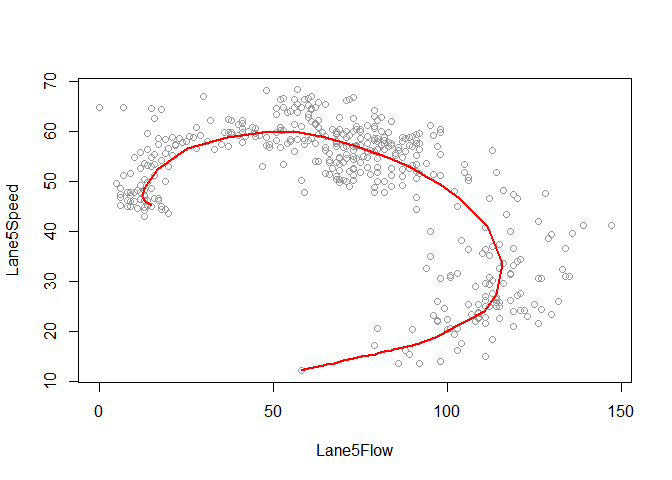
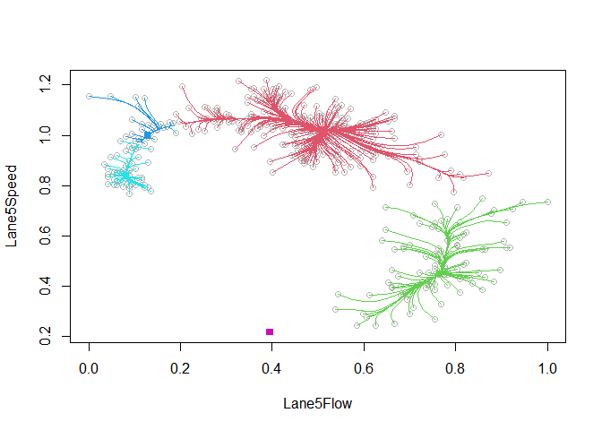

<!-- README.md is generated from README.Rmd. Please edit that file -->

# LPCM

<!-- badges: start -->

<!-- badges: end -->

This package can be used for fitting multivariate data patterns with
local principal curves, including tools for data compression
(projection) and measuring goodness-of-fit; with some additional
functions for mean shift clustering.

``` r
library(LPCM)
data(calspeedflow)
lpc1 <- lpc(calspeedflow[,3:4])
plot(lpc1, lwd=2, curvecol="red")
```

<!-- -->

``` r

ms1 <- ms(calspeedflow[,3:4], plot=FALSE)
plot(ms1)
```

<!-- -->

Try `?LPCM`, `?lpc` and `?ms`.
